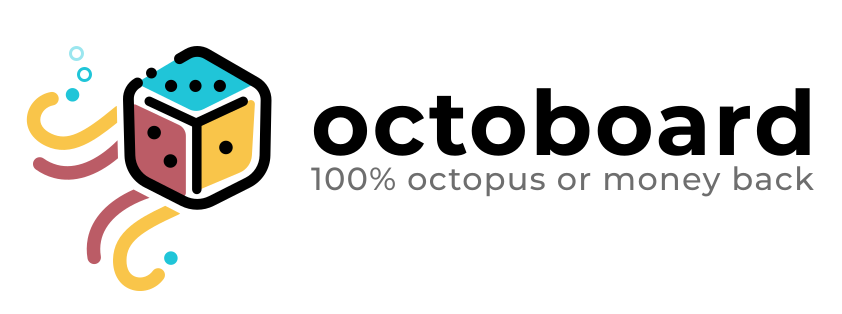

# Octoboard

This is a collection of games that may help you and your friends kill the boredom of COVID19 quarantine.

## Development

Install dependencies `npm install`. To run firebase emulator in development you also need to install Java Development Kit `jdk`.

Run development stack (react client, node server, firebase emulators, storybook) with `npm start`

Setting `debug=true` in URL query will show debug overlay.

### Ports

To make local development easier the services are started on the following custom ports (this helps avoid conflicts with other services running locally):
| Service | Port |
| --------- | ----- |
| Server | 11080 |
| Client | 11030 |
| Storybook | 11090 |
| Firestore | 11180 |
| Auth | 11190 |
| Hosting | 11150 |
| Emulators | 11140 |

### Running individual services

Sometimes you may want to run parts of application on their own. You can do this like this:

- Run firebase emulators with `npm run start:firebase`.
- Run react dev server with `npm run start:client`.
- Run game server with: `npm run start:server`.
- Run storybook wiht: `npm run start:storybook`.

## Note

This project uses the [boardgame.io](https://boardgame.io) framework which is open source game engine for turn-based games.

Licensed under [GNU AGPLv3](https://choosealicense.com/licenses/agpl-3.0/).
